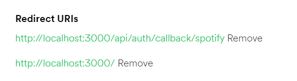

# sepia

### A Spotify Client made using NextJS, NextAuth, TailwindCSS

---


---

## Devlop Locally

- Clone the repo and install dependencies

  ```bash
  git clone https://github.com/ish-u/sepia.git
  cd sepia
  npm install
  ```

- Get necessary tokens, secrets and urls for the `.env` file

  - Get the `SPOTIFY_CLIENT_ID` and `SPOTIFY_CLIENT_SECRET` from the [Spotify Developers Dashboard](https://developer.spotify.com/dashboard/applications) --> [Reference](https://developer.spotify.com/documentation/general/guides/authorization/app-settings/)

  - Add the Callback URLs in the [Spotify Developers Dashboard](https://developer.spotify.com/dashboard/applications)

    

  - Get `DATABASE_URL` from your locally running PSQL DB or setup using [Docker](https://www.docker.com/) --> [docker-compose file](docker-compose.yml)

  - The Final `.env` file will look like this

    ```bash
    DATABASE_URL="*PSQL DB URL*"
    SPOTIFY_CLIENT_ID="YOUR SPOTIFY CLIENT ID"
    SPOTIFY_CLIENT_SECRET="*YOUR SPOTIFY CLIENT SECRET*"
    NEXTAUTH_SECRET="*YOUR SECRET*"
    NEXTAUTH_URL=http://localhost:3000/
    NEXT_PUBLIC_API=http://localhost:3000
    ```

- Generate [Prisma](https://www.prisma.io/) Client and apply migrations

  ```bash
  npx prisma generate
  npx prisma migrate dev --name init
  ```

- Run the application

  ```
  npm run dev
  ```

- The application will be live at [`http://localhost:3000/`](http://localhost:3000/)

## References

- [Spotify Web API](https://developer.spotify.com/documentation/web-api/)
- [Spotify Web Playback SDK](https://developer.spotify.com/documentation/web-playback-sdk/)
- [Spotify API Console](https://developer.spotify.com/console/)
- [NextAuth](https://next-auth.js.org/)
- [Prisma](https://www.prisma.io/)
- [Docker](https://www.docker.com/)
- [react-icons](https://react-icons.github.io/react-icons/)
- [tailwindcss](https://tailwindcss.com/)
- [Next.JS](https://nextjs.org/)

### To try the live demo ping me on discord - `ish-u#5812`
